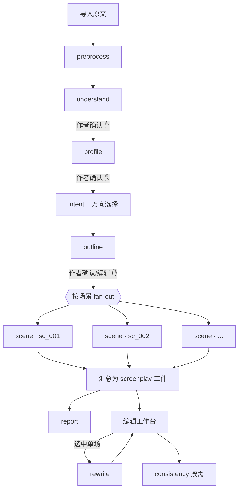
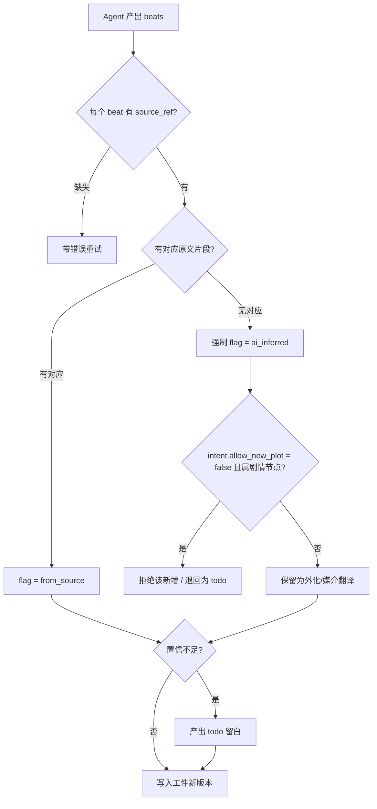

# Cardenio 入戏 Agent 工作流编排（Agent Workflow Orchestration）

> 把小说→剧本流程拆成一组**专职 Agent**，由确定性编排器驱动；定义每个 Agent 的契约、约束注入、信任能力的强制点，以及串行/并行拓扑。

## 文档信息

| 项目 | 内容 |
| --- | --- |
| 文档类型 | Agent 工作流编排设计 |
| 文档状态 | Draft |
| 关联文档 | [`design.md`](./design.md)（技术设计 · LLM 网关 §6）、[`requirements.md`](../product/requirements.md)（PRD · YAML Schema §7）、[`mvp-roadmap.md`](../product/mvp-roadmap.md) |
| 最近更新 | 2026-06-05 |

本文是 `design.md` §6「LLM 编排」的展开。沿用既定原则：**框架无关、LLM 提供方无关**；所有模型调用经统一的 `LlmGateway`，业务编排为确定性代码。需求编号沿用 PRD 的 `FR-x` / `P-x` / `NFR-x`。

---

## 1. 编排理念

> **控制流是确定性的代码；Agent 是有界、无状态、结构化输入输出的任务单元。**

我们不做「一个自主 Agent 自己决定下一步」的开放式 agent loop，而是用**编排器（Orchestrator）= 状态机 + 流水线**显式调度一组**专职 Agent**。原因直接来自 PRD：

- **可控与可溯源（P2/P4）**：流程顺序、确认关卡、信任标注必须可预测、可审计——确定性编排才能保证。
- **先理解再改编（P1）**：阶段间存在强制确认关卡，天然是状态机。
- **局部重生成（FR-9.2）**：生成单元必须可寻址、可独立重跑——要求 Agent 无状态、幂等于给定输入。
- **结构化输出（FR-8）**：每个 Agent 产出受 Schema 约束的对象，由网关校验，编排层只处理合法数据。

---

## 2. 编排原则

- **O1 确定性控制流**：阶段推进、分支、并行由代码决定，不交给模型自由发挥。
- **O2 结构化 I/O**：每个 Agent 有明确的输入上下文与输出 Schema（对齐 PRD §7）。
- **O3 校验—重试闭环**：输出不合 Schema 或缺关键字段（如 `source_ref`）→ 带错误重试有限次→ 仍失败则降级/上报，绝不把脏数据写入工件。
- **O4 信任在编排层强制**：`source_ref` 回填、`ai_inferred` 标注、意图门控、留白——由编排器校验，而非仅靠提示词「请记得标注」。
- **O5 约束注入**：`style_fingerprint`、`voice`、`hard_rules`、作者意图作为系统约束，由编排器装配进每次调用，不依赖模型记忆。
- **O6 上下文最小装配**：每个 Agent 只拿「完成本任务所需」的上下文（相关原文片段 + 上游工件 + 相邻单元），不灌整本（长文策略 NFR-3）。
- **O7 人在环路（HITL）**：关键节点停下等作者确认；AI 的删/并/加以「建议」呈现，作者拍板（P2/FR-6.1）。
- **O8 无状态幂等**：同一输入 + 约束 → 可复现输出单元；支撑局部重跑与缓存（NFR-5）。

---

## 3. Agent 角色清单

| Agent | id | 类型 | 职责 | 关联 |
| --- | --- | --- | --- | --- |
| 预处理 | `preprocess` | 确定性（+轻量 LLM 辅助切分） | 清洗、章节切分、建立**段落索引**（溯源根） | FR-1 |
| 作品理解 | `understand` | LLM | logline/主题/目标/恐惧/矛盾/基调；**风格指纹**；视角时态识别 + `non_visualizable` 标记 | FR-2 |
| 人物档案 | `profile` | LLM | 抽取人物、`voice`、`hard_rules`、关系、弧光、分类 | FR-3 |
| 意图编译 | `intent` | 确定性（表单→约束） | 把作者意图编译为下游硬约束；做意图—方向冲突校验 | FR-4/FR-5 |
| 分场大纲 | `outline` | LLM | 拆分场景、回填 `source_ref`、产出**合并建议** | FR-6 |
| 场景生成 | `scene` | LLM（按场景） | 媒介翻译：心理外化多方案、对白剧本化、节拍生成、来源标注、留白 | FR-7 |
| 一致性 | `consistency` | 确定性（改名）+ LLM（冲突检测） | 全局改名同步；按 `hard_rules` 检测冲突台词 | FR-9.4 |
| 改编报告 | `report` | 确定性聚合 + LLM（叙述化） | 从 `flag` 与版本 diff 聚合取舍清单，生成可读报告 | FR-10 |
| 局部重写 | `rewrite` | LLM（单单元） | 按自然语言指令只重写选中场/段，保持其余不变 | FR-9.2 |

> `preprocess` / `intent` 以确定性为主：能用规则做的不交给模型，降低不确定性与成本。`consistency` / `report` 是「确定性骨架 + LLM 润色」的混合体。

---

## 4. 编排拓扑

### 4.1 主流程（确认关卡串行 + 场景级并行）



- **✋ = 确认关卡**：未确认不进入下一 Agent（状态机强约束 P1）。
- **场景生成是唯一的并行点**：大纲定稿后，各场景相互独立，按场景 fan-out 并行生成（受并发上限约束），显著缩短整稿时长。
- **rewrite 在编辑期按需触发**，只作用于单个场景单元。

### 4.2 为什么场景级是并行边界
- 场景间一致性（人物、伏笔）通过**结构化工件**（`profile`、大纲的 `foreshadowing`）携带，而非依赖跨场景的生成顺序——因此各场景可独立生成。
- 跨场景的全局一致性问题留给 `consistency` 与 `report` 在汇总后处理，而非在生成时串行等待。

---

## 5. Agent 契约（输入 / 输出 / 约束 / 校验）

每个 Agent 经 `LlmGateway.generate({ task, systemConstraints, context, outputSchema })`（见 design.md §6.1）。下表给出契约要点。

### 5.1 `understand`（作品理解）
- **输入**：原文章节（或其分块）。
- **约束注入**：输出语言、改编方向（若已选）。
- **输出**：理解工件（logline/主题/目标/恐惧/矛盾/基调/`style_fingerprint`/视角时态/`non_visualizable` 段落列表/改编优劣）。
- **校验**：字段非空；含心理独白的章节须产出 ≥1 个 `non_visualizable` 标记（FR-2.1 验收）。
- **HITL**：作者确认/编辑后定稿，作为下游**事实源**。

### 5.2 `profile`（人物档案）
- **输入**：原文 + 理解工件。
- **输出**：人物数组（`name`/`role`/`voice`/`desire`/`fear`/`arc`/`relations`/`hard_rules`），对齐 §7 Schema。
- **校验**：覆盖原文具名主要人物；`voice`/`hard_rules` 非空。
- **HITL**：确认后，`voice`/`hard_rules` 成为台词生成的**硬约束**。

### 5.3 `intent`（意图编译，确定性）
- **输入**：作者表单 + 选定方向。
- **输出**：约束对象 `{ keep[], no_delete[], no_merge[], must_keep_lines[], mood_floor, allow_new_plot, allow_reorder, allow_new_ending, target_type }`。
- **校验**：方向—意图冲突（如「忠实改编」+「允许改结局」）→ 返回冲突提示由作者裁决（FR-5 验收）。

### 5.4 `outline`（分场大纲）
- **输入**：原文分块 + 理解 + 人物 + 意图。
- **约束注入**：意图（禁删/禁合并）、方向（节奏）。
- **输出**：场景数组，每场含 `source_ref`、目标、冲突、基调、伏笔、关系变化、结尾状态；**合并以建议字段产出**，不改结构（FR-6.1）。
- **校验**：每场 `source_ref` 非空且段落区间落在原文索引内（P4）。
- **HITL**：作者可增删/调序/编辑、采纳或拒绝合并建议后确认。

### 5.5 `scene`（场景生成 · 核心）
- **输入**：单个大纲场景 + 该场 `source_ref` 对应的原文片段 + 相邻场景摘要 + 人物档案 + 意图。
- **约束注入**：`style_fingerprint`、相关人物 `voice`/`hard_rules`、意图门控、`shot_hints` 开关。
- **输出**：该场 `beats[]`（action/dialogue/note/todo），每个 beat 带 `source_ref` 与 `flag`，心理段落产出 `options[]` 多方案（FR-7.1）。
- **校验（信任强制，见 §6）**：来源回填、`ai_inferred` 强制、意图门控、低置信留 `todo`。
- **粒度**：一次只生成一个场景 → 天然支持并行与局部重跑。

### 5.6 `rewrite`（局部重写）
- **输入**：目标场景当前版本 + 自然语言指令 + 前后场景 + 人物档案 + 意图。
- **输出**：该场景的**新版本节点**（仅此场），契约同 `scene`。
- **保证**：不读写其他场景；其余场景版本指针不变（FR-9.2 验收）。

### 5.7 `consistency`（一致性守护）
- **改名**：确定性全局替换 + 引用更新（人物 `id` 稳定，替换显示名）。
- **冲突检测**：LLM 按 `hard_rules` 扫描台词/动作，产出冲突清单（建议，非自动改）。

### 5.8 `report`（改编报告）
- **输入**：screenplay 工件 + 大纲/原文 diff。
- **确定性聚合**：从 `flag` 统计 `ai_inferred` 新增、`from_source` 保留；从 diff 得删除/合并。
- **LLM 叙述化**：把聚合结果写成可读报告，每条可定位到场景/原文。
- **校验**：报告统计与剧本 `flag` 标记**必须一致**，不一致视为失败（FR-10 验收，交叉核对 FR-7.5）。

---

## 6. 信任能力的编排级强制（关键）

这些是产品区别于「黑盒」的核心，**由编排器在校验环节强制，而非仅写在提示词里**（O4 / P4 / P5 / P6）：



强制点逐条：
- **溯源回填**：调用时把源片段段落区间随 prompt 下传，要求每个 beat 回填 `source_ref`；缺失即重试（不通过不落库）。
- **加戏强标注**：无对应源片段的 beat 一律 `ai_inferred`；`report` 据此交叉核对，统计不符判失败——这是 PRD 的**底线需求**（FR-7.5）。
- **意图门控**：`allow_new_plot = false` 时，编排器从**约束侧**拒绝带 `ai_inferred` 的剧情节点（只保留媒介翻译层面的外化），而非寄望模型自觉（FR-4 验收）。
- **留白**：模型对某 beat 置信不足 → 产出 `todo` 而非编造（P6）。
- **必留台词**：意图中的 `must_keep_lines` 在装配时注入并在输出中逐字校验存在、标 `from_source`。

---

## 7. 上下文装配策略（长文）

编排器为每个 Agent 装配「最小必要上下文」，避免整本灌入（NFR-3）：

| Agent | 上下文装配 |
| --- | --- |
| `understand` / `profile` | 按章节分块；跨块结论由编排器归并，而非靠超长上下文 |
| `outline` | 章节分块 + 理解/人物工件（摘要级） |
| `scene` | **仅**该场 `source_ref` 原文片段 + 相邻场景摘要 + 相关人物档案 + 意图 |
| `rewrite` | 目标场景 + 前后各一场 + 人物 + 意图 + 用户指令 |
| `report` | 结构化 diff 与 `flag` 统计（多为确定性数据，LLM 仅叙述化） |

跨场景一致性通过**结构化工件**（人物档案、伏笔表）携带，而非依赖生成顺序——这正是 §4.2 能并行的前提。超出可靠长度时**如实提示限制**，不静默截断。

---

## 8. 校验、重试与降级

```text
generate → Schema 校验 ─ 通过 → 信任校验(§6) ─ 通过 → 写入新版本
               │ 不通过                │ 不通过
               └──→ 带错误重试(≤N) ────┘
                        │ 仍失败
                        └──→ 降级: 标记该单元为 needs_attention + todo, 上报作者, 不污染已有版本
```

- 校验在 `LlmGateway` 收敛；领域层只接收合法对象。
- LLM 超时/限流/失败转为结构化错误，不向上抛厂商细节（provider 无关）。
- 任一场景生成失败**不影响**其他场景（并行隔离）与既有版本（NFR-6）。

---

## 9. 人在环路（HITL）节点

| 节点 | 作者动作 | 强制性 |
| --- | --- | --- |
| 理解定稿 | 确认/编辑 | 阻塞（P1） |
| 档案定稿 | 确认/编辑 | 阻塞（P1） |
| 意图/方向 | 填写/选择，解决冲突提示 | 阻塞 |
| 大纲 | 编辑、采纳/拒绝合并建议 | 阻塞 |
| 剧本编辑期 | 局部重写、采纳一致性建议、补 `todo` | 非阻塞、可反复 |
| 合并/删除/改名 | 二次确认 | 破坏性操作需确认 |

AI 的删/并/加一律是**建议**，作者不点不改结构（P2/FR-6.1）。

---

## 10. 可观测性与计量

- 每个 Agent 调用记录：`task`、token 用量、耗时、重试次数、校验失败原因。
- 指标：场景生成成功率、`ai_inferred` 占比、`todo` 数量、来源回填缺失率、信任校验失败率。
- 用途：成本可观测、质量回归、Prompt 迭代依据（提示词集中在 `docs/prompts/`，见 design.md §6.6）。

---

## 11. 与模块/里程碑映射

| Agent | 领域模块（design.md §4） | 里程碑（roadmap） |
| --- | --- | --- |
| `preprocess` | Import | M1 |
| `understand` / `profile` | Analysis | M2 |
| `intent` | Intent | M3 |
| `outline` | Outline | M4 |
| `scene` | Generation | M5 |
| `rewrite` | Rewrite | M6 |
| `consistency` | Consistency | M6（Should） |
| `report` | Report | M7 |

---

## 12. 开放问题

- **O1 场景并发上限**：fan-out 并发度与 provider 限流/成本的平衡阈值，待实测。
- **O2 分块边界**：`understand`/`outline` 的章节分块策略（按章 vs 按语义段）与跨块归并方式，需原型验证。
- **O3 重试上限 N 与降级文案**：校验失败的重试次数与 `needs_attention` 的呈现，待联调。
- **O4 一致性触发时机**：`consistency` 是实时增量还是显式触发，影响交互与成本。
- **O5 报告叙述化的确定性边界**：哪些部分纯聚合、哪些交给 LLM，避免报告与 `flag` 统计漂移。

> 关键编排决策（并行边界、重试策略、上下文装配）建议在进入 M5 前以 ADR 记录。
