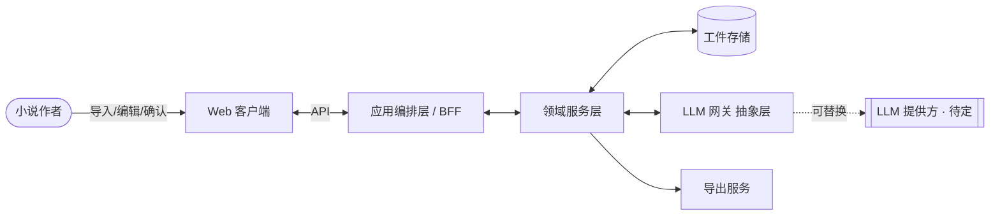
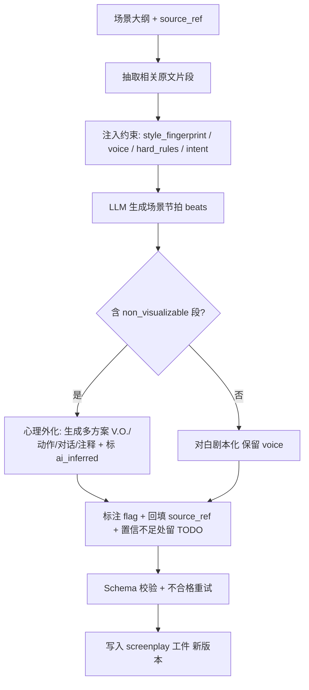
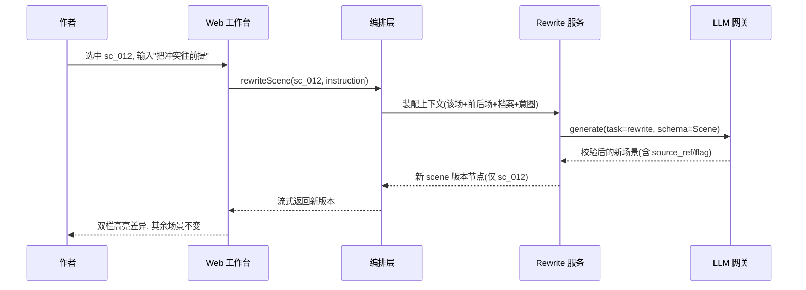

# Cardenio 入戏 技术设计文档（Design）

> 把 [PRD](../product/requirements.md) 的需求翻译为可实现的系统架构、领域模型、数据流与契约。

## 文档信息

| 项目 | 内容 |
| --- | --- |
| 文档类型 | 高层技术设计（HLD），面向研发 |
| 文档状态 | Draft（评审中） |
| 应用形态 | Web 应用（SaaS），从架构上为私有化/本地化预留接口 |
| 关联文档 | [`requirements.md`](../product/requirements.md)（需求与 YAML Schema）、[`mvp-roadmap.md`](../product/mvp-roadmap.md)（里程碑）、[`project-context.md`](../project-context.md) |
| 最近更新 | 2026-06-05 |

本设计有意保持**框架无关**与 **LLM 提供方无关**：具体前端框架、后端框架、模型/厂商均列为「待定」并给出决策标准（见 §11），架构层面以职责与契约描述，避免过早绑定。需求编号沿用 PRD 的 `FR-x` / `NFR-x`。

---

## 1. 设计目标与驱动力

设计直接服务 PRD 的 8 条原则（P1–P8）与非功能需求。最关键的几条驱动力：

| 驱动力 | 来源 | 对设计的硬性影响 |
| --- | --- | --- |
| 一切可溯源 | P4 / FR-8.1 | `source_ref` 是数据模型一等公民，贯穿生成、存储、编辑、报告 |
| AI 产物可区分 | P5 / FR-7.5 | `flag`（`from_source`/`ai_inferred`）由生成层强制写入，不可后补 |
| 先理解再改编 | P1 | 工件之间存在**确认关卡**，状态机强约束流程顺序 |
| 中间产物可编辑 | P8 | 每个阶段都是独立、可持久化、可回到的工件，而非临时态 |
| 局部重生成 | FR-9.2 | 生成单元必须可寻址到「场景/节拍」粒度，支持局部上下文重算 |
| 数据契约先行 | 路线图 M0 | YAML Schema 冻结于实现之前，序列化往返无损 |
| 数据隐私 | NFR-1 | 存储与 LLM 调用解耦为可替换层，支持「不用于训练」与私有化预留 |
| 风格保真 | NFR-2 | `style_fingerprint` / `voice` 作为生成约束在编排层强制注入 |

---

## 2. 架构总览

### 2.1 系统上下文



### 2.2 分层架构

采用经典分层 + 一个**可替换的 LLM 网关**，把「业务编排」与「模型调用」彻底解耦，以满足 provider 无关与隐私（NFR-1）要求。

```text
┌─────────────────────────────────────────────────────────┐
│ 表现层 (Web 客户端)                                        │
│  导入向导 · 理解/档案确认 · 大纲编辑 · 双栏剧本工作台 · 报告 │
├─────────────────────────────────────────────────────────┤
│ 应用编排层 (BFF / API)                                     │
│  会话与项目编排 · 流程状态机(确认关卡) · 鉴权 · 流式返回    │
├─────────────────────────────────────────────────────────┤
│ 领域服务层 (与框架无关的核心)                               │
│  Import · Analysis · Outline · Generation · Rewrite ·      │
│  Consistency · Report · Export                            │
│  ── 不依赖具体 Web 框架，可单测、可复用 ──                  │
├──────────────────────────┬──────────────────────────────┤
│ LLM 网关 (抽象)            │ 持久化 (工件存储 + 版本)        │
│  统一接口 · 结构化输出校验 │  Project/Artifact/Version       │
│  · 重试 · 缓存 · 用量计量  │  · 自动保存 · 溯源索引          │
└──────────────────────────┴──────────────────────────────┘
```

设计要点：
- **领域服务层不依赖 Web 框架**，便于将来在桌面/私有化形态中复用（呼应「Web + 私有化预留」）。
- **LLM 网关是唯一与模型对话的出口**：业务代码永远不直接拼 provider SDK，便于切换厂商、做缓存与隐私治理。
- **持久化与网关并列且互不耦合**：满足 NFR-1「存储与训练/调用解耦」。

---

## 3. 核心领域模型

### 3.1 项目与工件（Artifact）

一次改编是一个 **Project**，包含一组**有序、可编辑、可版本化**的工件。工件之间通过流程状态机推进（§7）。

```text
Project
├── meta            (标题, 语言三分, 改编方向, style_fingerprint)
├── source          (原文: 章节[] + 段落索引)        ← 溯源锚点的根
├── understanding   (作品理解, 需确认)                ← FR-2
├── characters      (人物档案[], 需确认)              ← FR-3
├── intent          (作者意图约束)                    ← FR-4
├── outline         (场景[], 每场含 source_ref)       ← FR-6
├── screenplay      (剧本 YAML, 见 PRD §7)            ← FR-7/FR-8
└── report          (改编取舍报告)                    ← FR-10
```

所有工件共享三类「信任字段」（贯穿设计）：
- `source_ref { chapter, paragraphs[] }` — 溯源锚点，根定义在 `source` 的段落索引上。
- `flag: from_source | ai_inferred` — 来源区分。
- `TODO` 节点 — 留白标记，可被检索与筛选。

### 3.2 寻址与版本模型（支撑局部重生成 / 分支）

- 每个 `scene` 有稳定 `id`（如 `sc_012`），每个 `beat`（动作/台词/注释/TODO）在场景内有序号。**「场景 + 节拍」是最小可重生成单元**（FR-9.2 的前提）。
- 版本采用 `version` + `parent_version`（见 PRD §7 `meta`），构成版本树，支持分支（FR-9.3）与回滚。
- **局部重生成只生成新 scene 版本节点**，不影响其他场景的版本指针——这是「只改动选中块」验收（FR-9.2）的实现保证。

---

## 4. 模块设计（对应 FR）

| 模块 | 职责 | 关键需求 | 设计要点 |
| --- | --- | --- | --- |
| Import | 解析/清洗/章节切分 | FR-1 | 解析器按格式插件化（TXT/DOCX…）；输出统一 `source` 模型并建立**段落索引**（溯源根） |
| Analysis | 作品理解 + 人物档案 | FR-2/FR-3 | 产出可编辑工件；标记 `non_visualizable`；采样 `style_fingerprint` / `voice` |
| Intent | 作者意图与方向约束 | FR-4/FR-5 | 转为下游编排的**硬约束输入**；做意图-方向冲突校验 |
| Outline | 分场大纲 | FR-6 | 每场绑定 `source_ref`；合并以「建议」产出，不自动改结构 |
| Generation | 大纲→剧本（媒介翻译） | FR-7 | 核心流水线（§6.2）：心理外化多方案、对白剧本化、加戏标注 |
| Rewrite | 局部重生成 | FR-9.2 | 以「场景+前后上下文+档案+意图」为输入，只重算目标单元 |
| Consistency | 一致性守护 | FR-9.4 | 改名全局同步；按 `hard_rules` 检测冲突台词 |
| Report | 改编取舍报告 | FR-10 | 从 `flag` 与版本 diff 聚合，保证与剧本标记一致 |
| Export | 导出 | FR-11 | 渲染器插件化：内部 YAML → Fountain/DOCX/PDF |

---

## 5. 数据持久化设计

### 5.1 存储模型
- `projects` / `artifacts`（带 `type`、`version`、`parent_version`、`updated_at`）/ `source_paragraphs`（溯源索引）。
- 工件正文以结构化文档存储（剧本即 PRD §7 的 YAML/等价 JSON）。**序列化往返无损**是硬指标（M0-T2 验收）。
- 自动保存：编排层在每个阶段与每次局部编辑后落盘，支持中断恢复（NFR-6）。

### 5.2 隐私与数据治理（NFR-1）
- **存储与 LLM 网关解耦**：原文与工件存于项目隔离空间；LLM 调用只传必要上下文。
- 提供「**不用于训练**」的明确设置与文案承诺；记录数据流向。
- 传输/静态加密，项目级隔离。
- **私有化预留**：存储层与网关层均为接口，未来可替换为本地存储 + 自托管模型，无需改动领域层。

---

## 6. LLM 编排设计（核心）

> 本节是产品价值与不确定性最高的部分（路线图 M5 风险提示）。设计目标：在 **provider 无关** 的前提下，让生成稳定产出结构化、可溯源、可区分来源的剧本。

### 6.1 LLM 网关抽象

业务层只面向一个稳定接口，屏蔽具体厂商：

```text
LlmGateway.generate({
  task,                  // 任务类型: understand | profile | outline | scene | rewrite | report
  systemConstraints,     // style_fingerprint, voice, hard_rules, author_intent
  context,               // 相关原文片段 + 上游工件(按需)
  outputSchema,          // 期望的结构化输出 Schema
}) -> { data(已校验), usage, raw }
```

网关统一负责：**结构化输出校验 + 失败重试、上下文裁剪、缓存、用量计量、超时与降级**。切换厂商只改网关实现，不动领域层。

### 6.2 媒介翻译流水线（Generation，FR-7）



关键落地（把「信任能力」做进生成层，而非事后补）：
- **`source_ref` 回填**：生成请求携带源片段的段落区间，要求模型在输出每个 beat 时回填来源；网关校验缺失则重试。
- **`ai_inferred` 强制**：凡无对应源片段的 beat 必须标 `ai_inferred`；Report 模块据此交叉核对（FR-10/FR-7.5），统计不一致视为生成失败。
- **意图门控**：当 `intent.allow_new_plot = false` 时，编排层拒绝接受带 `ai_inferred` 的**剧情节点**（仅允许媒介翻译层面的外化），从约束侧而非提示侧保证（FR-4 验收）。
- **留白**：模型对某 beat 置信不足时产出 `TODO` 而非编造（P6）。

### 6.3 结构化输出策略
- 优先使用 provider 的「结构化/工具调用」能力，让模型按 `outputSchema` 产出，再在网关侧做 **Schema 校验**；不通过则带错误信息重试有限次。
- 校验通过的对象才进入领域层——领域层永远拿到合法数据，不做文本解析。

### 6.4 长文策略（NFR-3）
- **按章节/场景为单位分块**，而非整本塞入上下文；编排层只为当前任务装配「必要上下文」（相关原文片段 + 上游工件摘要 + 相邻场景）。
- 跨场景一致性（人物、伏笔）通过**结构化工件**（人物档案、伏笔表）携带，而非依赖超长上下文记忆。
- 超出可靠处理长度时**如实提示限制**，不静默截断（呼应「无静默上限」原则）。

### 6.5 缓存与成本
- 原文与上游工件在一次会话中高度复用 → 网关做上下文级缓存以降本提速（具体机制依所选 provider 能力，列为待定）。
- 局部重生成只装配目标场景上下文，天然低成本、低延迟（NFR-5）。
- 网关统一**用量计量**，为成本可观测与限额留接口。

### 6.6 Prompt 管理
- 提示词与输出规范集中在 `docs/prompts/`（README 既定结构），与代码分离、可版本化、可评审。
- 每个 `task` 一组提示词模板，约束项（风格/voice/意图）以参数注入，避免散落硬编码。

---

## 7. 流程状态机与数据流

### 7.1 流程状态机（强制「先理解，再改编」P1）

```text
imported → understood(confirmed) → profiled(confirmed)
        → intent_set → outlined → generated → [editing ⇄ report] → exported
```

- 标 `confirmed` 的关卡未完成时，编排层**拒绝**进入下一阶段（FR-2/FR-3 验收）。
- `editing` 与 `report` 可反复往返；任何阶段都可回到上游工件编辑并触发受影响下游的「需重算」提示。

### 7.2 局部重生成时序（FR-9.2 核心交互）



---

## 8. API 契约（高层，框架无关）

以资源 + 动作描述，不绑定具体协议实现：

| 能力 | 契约（示意） | 关联 |
| --- | --- | --- |
| 项目/工件 CRUD | `Project`, `Artifact` 读写 | P8/NFR-6 |
| 阶段生成 | `generate(projectId, stage)` | FR-2/3/6/7 |
| 局部重生成 | `rewriteScene(projectId, sceneId, instruction)` | FR-9.2 |
| 一致性操作 | `renameCharacter`, `checkConsistency` | FR-9.4 |
| 报告 | `buildReport(projectId, version)` | FR-10 |
| 导出 | `export(projectId, format)` | FR-11 |
| 溯源 | `resolveSourceRef(ref) → 原文段落` | P4/FR-9.1 |

生成类接口支持**流式返回**，以满足长任务的进度反馈（NFR-5）。

---

## 9. 横切关注点

- **可靠性（NFR-6）**：自动保存 + 版本不可变节点；生成失败不污染已有版本；中断可恢复。
- **错误处理**：LLM 超时/限流/校验失败在网关收敛，向上返回结构化错误；领域层不感知厂商错误。
- **一致性守护（FR-9.4）**：人物改名走全局替换 + 引用更新；改 `hard_rules` 触发冲突扫描。
- **国际化（NFR-7）**：UI / Source / Output Language 在 `meta` 三分；文案与模型提示词均参数化，不硬编码语言。
- **可观测性**：LLM 用量、各阶段耗时、校验重试率纳入指标，支撑成本与质量监控。
- **风格保真（NFR-2）**：`style_fingerprint`/`voice` 由编排层在每次生成强制注入，禁止「编剧腔」覆盖。

---

## 10. 目录结构建议（与 README 规划对齐）

```text
app/
  import/    analysis/   outline/   script/   report/   editor/   settings/
packages/ (或等价分层，框架确定后定)
  domain/    领域服务层(框架无关): import/analysis/outline/generation/rewrite/consistency/report/export
  llm/       LLM 网关抽象 + provider 适配
  schema/    YAML/工件类型与校验(对应 docs/schema)
  storage/   持久化与版本
docs/
  product/   设计文档以外的产品文档(PRD/路线图)
  design/    本文件
  prompts/   提示词与输出规范
  schema/    数据结构与导出格式说明
```

---

## 11. 技术选型（候选与决策标准 · 待定）

按你的选择「先写架构再选框架/模型」，此处只列候选与判据，**不在本文档定死**；选定后另起 ADR 或更新本节。

| 维度 | 候选 | 决策标准 |
| --- | --- | --- |
| 语言 | TypeScript（仓库已用 pnpm workspace，倾向 TS 生态） | 与现有 monorepo 一致、类型即契约（Schema 校验） |
| 前端框架 | Next.js / React SPA+独立后端 / 其他 | MVP 演示速度、SSR 需求、双栏编辑器实现成本 |
| 后端形态 | BFF 与前端同栈 / 独立服务 | 团队规模、私有化部署诉求 |
| 持久化 | 关系型 / 文档型 | 工件版本树与溯源索引的查询形态 |
| LLM 提供方 | 待定（网关抽象屏蔽） | 结构化输出能力、上下文窗口、缓存、成本、隐私/私有化可行性 |
| 富文本/剧本编辑器 | 待定 | 双栏联动、节拍级寻址、所见即所得 ↔ YAML 切换 |

**强约束（无论选型如何都成立）**：
1. 领域服务层与 Web 框架解耦。
2. LLM 调用只经网关。
3. YAML Schema 序列化往返无损，`source_ref`/`flag` 不丢。

---

## 12. 设计 ↔ 里程碑映射

| 里程碑 | 本设计对应章节 |
| --- | --- |
| M0 数据契约/地基 | §3 领域模型、§5 存储、§10 目录、§11 强约束 |
| M1 导入 | §4 Import、§3.1 source 段落索引 |
| M2 理解/档案 | §4 Analysis、§6.1 网关、§7.1 确认关卡 |
| M3 意图/方向 | §4 Intent、§6.2 意图门控 |
| M4 大纲 | §4 Outline、§3.2 寻址 |
| M5 剧本生成 | §6.2 媒介翻译流水线、§6.3 结构化输出 |
| M6 工作台 | §3.2 版本/寻址、§7.2 局部重生成时序、§8 溯源 |
| M7 报告 | §4 Report、§6.2 flag 交叉核对 |
| M8 收尾 | §5.2 隐私、§9 横切 |

---

## 13. 开放问题（待决策）

- **O1 前端框架与编辑器选型**：双栏联动 + 节拍级寻址 + WYSIWYG↔YAML 切换是选型的最大约束，需原型验证。
- **O2 LLM 提供方与结构化输出方式**：结构化输出与上下文窗口能力直接决定 §6.3/6.4 实现，需对候选做小样本验证。
- **O3 持久化形态**：版本树 + 溯源索引更适合关系型还是文档型，待数据量与查询模式明确后定。
- **O4 私有化边界**：SaaS 优先，但「本地存储 + 自托管模型」要支持到何种程度，影响网关与存储抽象的粒度。
- **O5 长文上限**：MVP 明确支持的最大篇幅与超限时的降级策略（NFR-3）需给出具体阈值。

> 开放问题建议在进入对应里程碑前，以独立 ADR（Architecture Decision Record）记录决策与理由。
